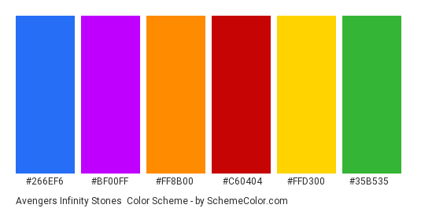

# Avengers Snap - by Russell Oakham

## Project overview

'Avengers Snap' is an interactive card matching game themed around Marvels Avengers.

The game is created to engage and entertain users of all ages, especially those who enjoy Marvels comic and cinematic universe. It has been designed to be immersive and stimulating to users, via interactive elements such as animations and sound cues. The game is easy to play, but offers various difficulty lessions for prolonged user engagement.

I have used HTML, CSS and Javascript to build the game, ensuring it is fully responsive to the users chosen device.

*responsive demo*

## Deployed site
A live version of the website can be found *here*.

## Table of Contents

1. [**UX**](#ux)
    - [**User-Stories**](#user-stories)
    - [**Structure**](#structure)
    - [**Skeleton**](#skeleton)
    - [**Surface**](#surface)

2. [**Features**](#features)
    - [**Existing Features**](#existing-features)
    - [**Features to consider in future**](#features-to-consider-implementing-in-future)

3. [**Technologies Used**](#technologies-used)

4. [**Testing**](#testing)

5. [**Deployment**](#deployment)
    - [**GitHub Pages**](#github-pages)

6. [Credits](#credits)
    - [**Design and Research**](#design-and-research)
    - [**Technical**](#technical)
    - [**Content**](#content)
    - [**Media**](#media)
    - [**Acknowledgements**](#acknowledgements)

## 1. UX

Overview of UX decisions, structure etc. Examples of websites I have viewed as part of research & resulting UX design decisions.

### User Stories
 - As a curious user, I want the home screen to be visually appealing, as this will positively aid my decision in whether I want to play the game. 
 - As a user, I want the site to be easy and intuitive to navigate.
 - As a user, I want to easily access the game, tutorials, difficulty and audio controls for the website.
 - As a user, I want to be able to choose a difficulty level for the game and know how the game changes across difficulty.
 - As a user, I want to be able to restart the game if necessary, without having to navigate away from the game screen.
 - As a user, I want to be able to keep track of the number of moves I make and the time I take to complete the game, so I can try to improve on future plays.
 - As a user, I want the cards to be randomised, so the image locations are different with each replay. 

### Structure
As the purpose of the website is to showcase the card game, I want to ensure the rest of the website is simple and each page element enhances the game experience. Therefore I followed the following structure;

 - **Home Page**: Containing the following elements.
    - *Header/Footer*: For easy navigation across the site.
    - *Website Logo*: To easily identify the 'Avengers Snap' game branding.
    - *Avengers Snap Game*: Card Matching Game, with timer, move counter and reset button.
    - *Starting Modal*: Modal on page load, explaining how to play and prompting user to choose difficulty.
    - *Game Complete Modal*: Modal on game completion, congratulating player, providing move and timer score. Prompts to play again, or change difficulty.

- **Avengers Page**: Page providing additional information about Marvels Avengers, plus Bio's for featured heroes.

### Skeleton
At this point I began creating wireframes, using the above structure considerations. I used [Balsamiq](https://balsamiq.com/) these below;

- [Home page on desktop and mobile]()
- [Home Page - welcome modal on desktop and mobile]()
- [Home Page - game complete Modal on desktop and mobile]()
- [Avengers Page on desktop and mobile]()

### Surface
This is the sensory design section of a website, or how it looks, feels and sounds. I wanted the design to be clean and the colour scheme to be reminiscent of Marvels cinematic universe, as it is a very popular brand internationally. 

#### Colour
As the game is inspired by Marvels Avengers, I was keen to use a colour scheme in line with their brand, so it is instantly recognisable to fans of the franchise.

With this in mind I chose the below as core design colours for the website;
- Hot Rod Red - #a50000
- Captain America - #3268bd
- Hulk - #00991f
- Mjolnir - #999999
- Hawkeye - #460061
- Cyber Yellow - #FFD300

The colour palettes were originally curated by iamtheagirl on [color-hex.com](https://www.color-hex.com/color-palette/7706) and Vivid Narwhal on [schemecholor.com](https://www.schemecolor.com/avengers-infinity-stones.php).

#### Language/Tone 
I wanted the language to reflect the casual and fun atmosphere of the game, so content was written in line with this. Avoiding technical or formal language where possible.

#### Styling Considerations
Before beginning development, I listed some styling ideas that I felt benefit the website. Majority of these can be seen in the wireframes.

 - Favicon: Desktop and Mobile.
 - Game: 
    - Cards react to mouse hover (transform: Zoom) to add a level of interaction and excitement to selecting cards.
    - Card Border Shadows - flash red when cards are matched incorrectly, turn to static green when cards matched correctly.
    - Audio Cues: To further inmprove interactivity and accessibility, play audio sound cues when cards are flipped. With additional positive/negative cues for if cards are matched correctly or incorrectly.
 - Modals:
    - Welcome Modal: Pop up on game page load, explaining how to play the game, plus provide difficulty options.
    - Completion Modal: Pop up once game is complete, congratulating player and providing move and time scores. Offer option to play again or 
 - Navigation
    - Sticky top
    - Mobile: 'Burger' menu icon, expanding on click.
    - Logo: Navigates to home page on click.

## 2. Features

### Existing Features
#### **The Header** includes:

 #### **The Footer** includes:

 Both the Header and Footer are present and consistent on all website pages.

 #### **Home** page includes:

 **Favicon**: Present on every page and in the form of business logo, allows users to identify the site by just seeing the icon on tab.

### Features to consider implementing in future

## 3. Technologies Used
1. [HTML](https://en.wikipedia.org/wiki/HTML) - Programming language providing content and structure of website.
2. [CSS](https://en.wikipedia.org/wiki/CSS) - Programming language providing styling of website.
3. [Bootstrap CSS Framework](https://getbootstrap.com/) - Library of pre-built HTML and CSS components, used for various aspects of the site, such as navigation bar.
4. [Font Awesome](https://fontawesome.com/) - Library used for icons, such as social links and heat chillis.
5. [Google Fonts](https://fonts.google.com/) - Used to choose a font style for the website.
6. [TinyPNG](https://tinypng.com/) & [TinyJPG](https://tinyjpg.com/): To minimise image file sizes and maximise page load speed.
7. [ResizePixel](https://www.resizepixel.com/) - To manipulate image size and dimensions.
8. [Real Favicon Generator](https://realfavicongenerator.net/) to generate favicons and icons for desktop and mobile usage.
9. [Am I Responsive?](http://ami.responsivedesign.is/) used for responsive design demo in ReadMe summary.
10. [GitHub](https://github.com/) - Remote hosting platform and code repository.
11. [GitPod](https://gitpod.io/) - IDE (Integrated Development Environment), for writing, editing and saving code.
12. [Balsamiq](https://balsamiq.com/) - Used for creation of wireframes for visual design testing.
13. [Autoprefixer](https://autoprefixer.github.io/) - Used to add vendor prefixes to CSS rules.
14. [Responsive Design Checker](https://www.responsivedesignchecker.com/) - Used to check website response across device types.
15. [BrowserStack](https://www.browserstack.com/) - Used to check website response across device types.

## 4. Testing
The testing process can be seen in the [TESTING.md](TESTING.md) document.

## 5. Deployment

### Github Pages
The site is hosted using GitHub pages, deployed directly from the master branch of GitHub. The deployed site will update automatically as new commits are pushed to the master branch.

#### How I deployed my project to GitHub pages.
To host on GitHub pages you must follow these steps:

1. Go to [GitHub.com](https://github.com/)
2. Login to my account.
3. Click on 'Responsitories'
4. Click on 'Avengers Snap'
5. Go to the 'Settings' tab
6. Scroll down to the 'GitHub Pages' section and set the source to 'Master Branch'. This turns on GitHub pages for the repository.
7. Reload the page. Scroll back to 'GitHub Pages' section, where the new URL for the deployed site can be found.

Additional information around these steps can be found on the [GitHub Pages Help Page](https://docs.github.com/en/github/working-with-github-pages/creating-a-github-pages-site).

#### Hot to clone 'CI-Milestone-Project-1' in GitHub and GitPod.
To run a version of the site locally, you can clone this repository using the following steps;

In a code editor of your choice;

1. Go to [GitHub.com](https://github.com/)
2. Login to my account.
3. Click on 'Responsitories'
4. Click on 'Avengers Snap'
5. Click on the 'Code' button.
6. Under 'HTTPS' click the clipboard icon to the right of the URL.
7. In your IDE of choice, open repository or create a new repository.
8. Open Terminal ('Terminal' then 'New Terminal' from top ribbon menu in GitPod.)
9. Type 'git clone', paste URL link and press enter.

Additional information around these cloning steps can be found on [GitHub Pages Help Page](https://docs.github.com/en/github/creating-cloning-and-archiving-repositories/cloning-a-repository).

## 6. Credits

### Design and research

### Technical

### Content
All text content on the site was written originally by myself, with the below notes;

### Media
The colour palette for the site was originally created by;
 - iamtheagirl - [color-hex](https://www.color-hex.com/color-palette/7706)

The photos and images used for this site were obtained from;

### Acknowledgements
 - Thanks to my mentor, [Precious Ijege](https://github.com/precious-ijege) for his suggestions, time and support.
 - Thanks to those on Slack for reviewing my project and making suggestions.
 - Thanks to my housemates, friends and family for reviewing the project and offering constructive feedback.