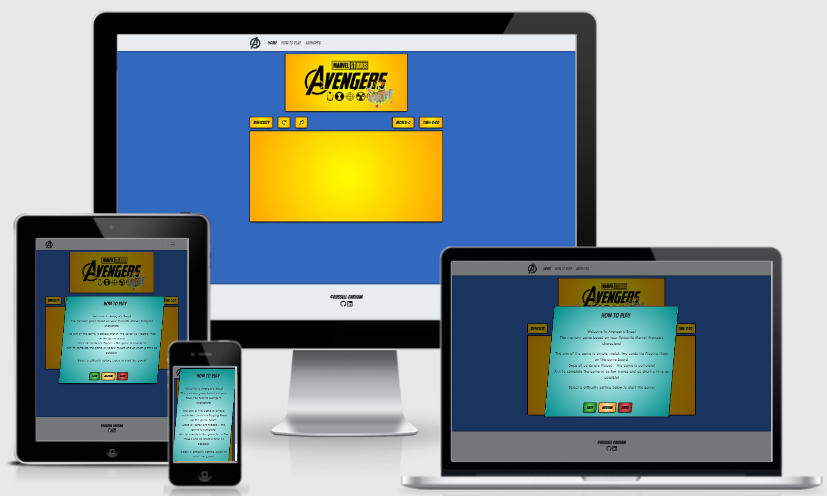
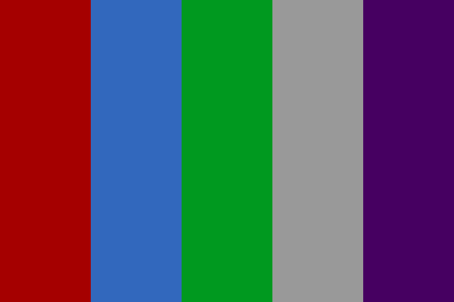

# Avengers Snap - by Russell Oakham

## Project overview

'Avengers Snap' is an interactive card matching game themed around Marvels Avengers.

The game is created to engage and entertain users of all ages, especially those who enjoy Marvels comic and cinematic universe. It has been designed to be immersive and stimulating to users, via interactive elements such as animations and sound cues. The game is easy to play but offers various difficulty lessons for prolonged user engagement.

I have used HTML, CSS and Javascript to build the game, ensuring it is fully responsive to the users chosen device.

## Deployed site
The live website can be found at the following link;
[Avengers Snap](https://russoakham.github.io/Avengers-Snap/)

## Table of Contents

1. [**UX**](#1.-ux)
    - [**User-Stories**](#user-stories)
    - [**Structure**](#structure)
    - [**Skeleton**](#skeleton)
    - [**Surface**](#surface)

2. [**Features**](#2.-features)
    - [**Existing Features**](#existing-features)
    - [**Features to consider in future**](#features-to-consider-implementing-in-future)

3. [**Technologies Used**](#3.-technologies-used)

4. [**Testing**](#4.-testing)

5. [**Deployment**](#5.-deployment)
    - [**GitHub Pages**](#github-pages)

6. [**Credits**](#6.-credits)
    - [**Design and Research**](#design-and-research)
    - [**Technical**](#technical)
    - [**Content**](#content)
    - [**Media**](#media)
    - [**Acknowledgements**](#acknowledgements)

## 1. UX

Overview of UX decisions, structure etc. Examples of websites I have viewed as part of research & resulting UX design decisions.

### User Stories
 - As a curious user, I want the home screen to be visually appealing, as this will positively aid my decision in whether I want to play the game. 
 - As a user, I want the site to be easy and intuitive to navigate.
 - As a user, I want to easily access the game, tutorials, difficulty and audio controls for the website.
 - As a user, I want to be able to choose a difficulty level for the game and know how the game changes across difficulty.
 - As a user, I want to be able to restart the game if necessary, without having to navigate away from the game screen.
 - As a user, I want to be able to keep track of the number of moves I make and the time I take to complete the game, so I can try to improve on future plays.
 - As a user, I want the cards to be randomised, so the image locations are different with each replay. 

### Structure
As the purpose of the website is to showcase the card game, I want to ensure the rest of the website is simple and each page element enhances the game experience. Therefore I followed the following structure;

 - **Home Page**: Containing the following elements.
    - *Header/Footer*: For easy navigation across the site.
    - *Website Logo*: To easily identify the 'Avengers Snap' game branding.
    - *Avengers Snap Game*: Card Matching Game, with timer, move counter and reset button.
    - *Starting Modal*: Modal on page load, explaining how to play and prompting the user to choose a difficulty.
    - *Game Complete Modal*: Modal on game completion, congratulating player, providing move and timer score. Prompts to play again, or change the difficulty.

- **Avengers Page**: Page providing additional information about Marvels Avengers, plus Bio for featured heroes.

### Skeleton
At this point I began creating wireframes, using the above structure considerations. I used [Balsamiq](https://balsamiq.com/) these below;

- [Home page on desktop and mobile](design-resources/images/Home.PNG)
- [Home Page - welcome modal on desktop and mobile](design-resources/images/Modals.PNG)
- [Avengers Page on desktop and mobile](design-resources/images/Avengers-Page.PNG)

### Surface
This is the sensory design section of a website, or how it looks, feels and sounds. I wanted the design to be clean and the colour scheme to be reminiscent of Marvel's cinematic universe, as it is a very popular brand internationally. 

#### Colour & Comic Styling
As the game is inspired by Marvels Avengers, I was keen to use a colour scheme in line with the Marvel brand and maintain a comic book feel, so the site identity is instantly recognisable to fans of the franchise.

With this in mind I chose to use variations of the below colours for the core design of the website;
- Blue
- Yellow
- Orange
- Green
- Red
- Purple

For the page background, I chose a 'Captain America Blue' (Hex: #3268BD) which was originally curated by iamtheagirl on [color-hex.com](https://www.color-hex.com/color-palette/7706).

To achieve a strong comic book style I researched online and found the following article which I used for inspiration. The article shows that via the use of CSS techniques such as radial-gradient colour backgrounds and skew on some elements, you can achieve a strong comic book identity for your site.

[Code my UI - CSS Only Mobile-Friendly Comic Book Layout](https://codemyui.com/css-mobile-friendly-comic-book-layout/)

#### Language/Tone 
I wanted the language to reflect the casual and fun atmosphere of the game, so content was written in line with this. Avoiding technical or formal language where possible.

Similarly, I wanted to use fonts that reinforce the strong comic book identity of the site. To achieve this I used two [Google Fonts](https://fonts.google.com/);

- [Bangers](https://fonts.google.com/specimen/Bangers?preview.text_type=custom)
- [Comic Neue](https://fonts.google.com/specimen/Comic+Neue?preview.text_type=custom)
- Cursive- Web safe font, used if primary two fonts fail to load.

#### Styling Considerations
Before beginning development, I listed some styling ideas that I felt benefit the website. The majority of these can be seen in the wireframes.

 - Favicon: Desktop and Mobile.
 - Game: 
    - Cards react to mouse hover (transform: Zoom) to add a level of interaction and excitement in selecting cards.
    - Card Border Shadows - flash red when cards are matched incorrectly, turn to static green when cards matched correctly.
    - Audio Cues: To further improve interactivity and accessibility, play audio sound cues when cards are flipped. With additional positive/negative cues for if cards are matched correctly or incorrectly.
 - Modals:
    - Welcome Modal: Pop up on game page load, explaining how to play the game, plus provide difficulty options.
    - Completion Modal: Pop up once the game is complete, congratulating the player and providing move and time scores. Offer option to play again or 
 - Navigation
    - Sticky top
    - Mobile: 'Burger' menu icon, expanding on click.
    - Logo: Navigates to the home page on click.

## 2. Features

### Existing Features
#### **The Header** includes:
- **Website Logo**: Builds brand awareness amongst users.
- **Navigation Bar**: Allows users to navigate the site easy and intuitively.
- **How To Play**: Link to modal popup, providing user instructions and game difficulty options.

#### **The Footer** includes:
- **Website Developer**: Copyright information for website developer brand awareness.
- **Social Links**: Links to GitHub and LinkedIn of website developer for brand awareness.

Both the Header and Footer are present and consistent on all website pages.

#### **Home** page includes:
- **Image Banner**: Visually pleasing design, allowing users to immediately identify the site brand.
- **Game Controls**: Ribbon of buttons above the game panel, allowing users quick access to game controls.
    - ***Difficulty***: Calls 'How To Play' modal, which allows users to change the game difficulty.
    - ***Restart***: Restart current game at same difficulty, reshuffling cards, resetting time and move counters.
    - ***Audio***: Calls 'Sound Effects' Modal, which allows users to change the volume of sound effects or mute if they wish.
    - ***Move Counter***: Records the number of moves made by users as they proceed through the game.
    - ***Timer***: Records time elapsed as users proceed through the game.
- **Game Panel**: The panel houses the game cards, which are populated when game difficulty is chosen.

##### **Home Page Modals**:
- **How to Play Modal**: Modal pops up on page load, providing user instructions and game difficulty options.
- **Sound Effects Modal**: Modal pops up when the audio button pressed, allowing users to change the volume of sound effects or mute if they wish.
- **Congratulations Modal**: Modal pops up on game completion, congratulating user on finishing the game, provides moves and time score.  Also prompts the user to replay the game at the same or higher difficulty.

#### **Avengers** page includes:
- **Image Banner**: Visually pleasing design, allowing users to immediately identify the site brand.
- **Avengers Bios**: Image and short biographies for all marvel characters featured in the game, allowing users to gain a better understanding of the game's characters.

**Favicon**: Present on every page and in the form of the game logo, allows users to identify the site by just seeing the icon on the tab.

### Features to consider implementing in future

**Leaderboard**

 - Add ability to input a username, for the game to save user move, timer and difficulty scores and display on a global leaderboard. As this would require configuration to save and fetch data from a server, this has not yet been implemented.

## 3. Technologies Used
1. [HTML](https://en.wikipedia.org/wiki/HTML) - Programming language providing content and structure of the website.
2. [CSS](https://en.wikipedia.org/wiki/CSS) - Programming language providing styling of the website.
3. [JavaScript](https://en.wikipedia.org/wiki/JavaScript) - The programming language used various interactive elements of the website, including game logic, audio options etc.
4. [Bootstrap CSS Framework](https://getbootstrap.com/) - Library of pre-built HTML and CSS components, used for various aspects of the site, such as navigation bar.
5. [Font Awesome](https://fontawesome.com/) - Library used for icons, such as social links and heat chillis.
6. [Google Fonts](https://fonts.google.com/) - Used to choose a font style for the website.
7. [TinyPNG](https://tinypng.com/) & [TinyJPG](https://tinyjpg.com/): To minimise image file sizes and maximise page load speed.
8. [remove.bg](https://www.remove.bg/) - Used to remove backgrounds from png images.
9. [Real Favicon Generator](https://realfavicongenerator.net/) to generate favicons and icons for desktop and mobile usage.
10. [Am I Responsive?](http://ami.responsivedesign.is/) used for responsive design demo in ReadMe summary.
11. [GitHub](https://github.com/) - Remote hosting platform and code repository.
12. [GitPod](https://gitpod.io/) - IDE (Integrated Development Environment), for writing, editing and saving code.
13. [Balsamiq](https://balsamiq.com/) - Used for the creation of wireframes for visual design testing.
14. [Autoprefixer](https://autoprefixer.github.io/) - Used to add vendor prefixes to CSS rules.
15. [Responsive Design Checker](https://www.responsivedesignchecker.com/) - Used to check website response across device types.
16. [Lambdatest](https://www.lambdatest.com/) - Used to check website response across device types.
17. [Photopea](https://www.photopea.com/) - Used to create avengers snap page banner image, via layering two pngs together.

## 4. Testing
The testing process can be seen in the [TESTING.md](TESTING.md) document.

## 5. Deployment

### Github Pages
The site is hosted using GitHub pages, deployed directly from the master branch of GitHub. The deployed site will update automatically as new commits are pushed to the master branch.

#### How I deployed my project to GitHub pages.
To host on GitHub pages you must follow these steps:

1. Go to [GitHub.com](https://github.com/)
2. Login to my account.
3. Click on 'Responsitories'
4. Click on 'Avengers Snap'
5. Go to the 'Settings' tab
6. Scroll down to the 'GitHub Pages' section and set the source to 'Master Branch'. This turns on GitHub pages for the repository.
7. Reload the page. Scroll back to 'GitHub Pages' section, where the new URL for the deployed site can be found.

Additional information around these steps can be found on the [GitHub Pages Help Page](https://docs.github.com/en/github/working-with-github-pages/creating-a-github-pages-site).

#### Hot to clone 'Avengers-Snap' in GitHub and GitPod.
To run a version of the site locally, you can clone this repository using the following steps;

In a code editor of your choice;

1. Go to [GitHub.com](https://github.com/)
2. Login to my account.
3. Click on 'Responsitories'
4. Click on 'Avengers Snap'
5. Click on the 'Code' button.
6. Under 'HTTPS' click the clipboard icon to the right of the URL.
7. In your IDE of choice, open a repository or create a new repository.
8. Open Terminal ('Terminal' then 'New Terminal' from the top ribbon menu in GitPod.)
9. Type 'git clone', paste URL link and press enter.

Additional information around these cloning steps can be found on [GitHub Pages Help Page](https://docs.github.com/en/github/creating-cloning-and-archiving-repositories/cloning-a-repository).

## 6. Credits

### Design and research
The following are websites and articles that I used for reference and inspiration:
- [scotch.io - How to build a memory matching game in JavaScript](https://scotch.io/tutorials/how-to-build-a-memory-matching-game-in-javascript) - Used to game design and code inspiration.
- [Code my UI - CSS Only Mobile-Friendly Comic Book Layout](https://codemyui.com/css-mobile-friendly-comic-book-layout/) - Used for inspiration of comic book styling using CSS.
- [Marvel Cinematic Universe Fandom](https://marvelcinematicuniverse.fandom.com/wiki/Marvel_Cinematic_Universe_Wiki) - Used for referencing Marvel character designs, colour pallets and character biographies.

### Technical
- [Real Favicon Generator](https://realfavicongenerator.net/): For the generation of Favicon icons and code.
- [Bootstrap Docs](https://getbootstrap.com/docs/5.0/getting-started/introduction/): For guidance on Bootstrap use and adaptations.
- [CSS-Tricks](https://css-tricks.com/): For implementing CSS effects such as box-shadow.
- [w3Schools](https://www.w3schools.com/): For checking proper syntax of HTML and CSS elements. 
- [Autoprefixer](https://autoprefixer.github.io/) - For generating CSS browser prefixes.
- [Stackoverflow](https://stackoverflow.com/) - For researching and troubleshooting JavaScript code issues.

### Content
All text content on the site was written originally by myself, with the below notes;
- **Avengers Bio's**: Inspired and adapted from [Marvel Cinematic Universe Fandom](https://marvelcinematicuniverse.fandom.com/wiki/Marvel_Cinematic_Universe_Wiki) character pages.

### Media
The colour palette for the site was inspired and adapted from;
 - iamtheagirl - [color-hex](https://www.color-hex.com/color-palette/7706)

The photos and images used for this site were obtained from;
- **[Shutterstock](https://www.shutterstock.com/)**: From the following contributors;
    - [Captain America Bio Picture](https://www.shutterstock.com/image-vector/vector-superhero-posing-isolated-on-white-436277203): Aratehortua
    - [Snap logo](https://www.shutterstock.com/image-illustration/snap-comic-speech-bubble-cartoon-abstract-1885280836): Suryamann
    - [Avengers Banner Logo](https://www.shutterstock.com/image-photo/kiev-ukraine-february-19-2019-set-1328369057): Rose Carson.
**Game Card Images**:
- **[iconfinder.com](https://www.iconfinder.com/)**;
    Game Card Images:
    - [Groot](https://www.iconfinder.com/icons/2624888/fighting_free_groot_super_hero_icon), [Captain America](https://www.iconfinder.com/icons/2624896/avengers_captain_captain_america_super_hero_icon), [Iron Man](https://www.iconfinder.com/icons/2624893/avengers_iron_man_marvel_super_hero_icon), [Spiderman](https://www.iconfinder.com/icons/2624863/hero_marvel_spider_man_super_hero_icon), [Ant-Man](https://www.iconfinder.com/icons/2624864/c_-_3po_robot_see_-_threepio_star_wars_icon), [Thor](https://www.iconfinder.com/icons/2624889/hero_super_thor_wings_icon), [Hawkeye](https://www.iconfinder.com/icons/2624860/hawkeye_hero_marvel_characteristic_super_hero_icon), [Thanos](https://www.iconfinder.com/icons/2624867/humanoid_loki_super_villain_thanos_icon), [Daredevil](https://www.iconfinder.com/icons/2624861/daredevil_marvel_mutant_super_hero_icon), [Wolverine](https://www.iconfinder.com/icons/2624866/evil_batman_marvel_super_hero_x_-_men_icon), and [Deadpool](https://www.iconfinder.com/icons/2624861/daredevil_marvel_mutant_super_hero_icon): Vectto
    - [Hulk](https://www.iconfinder.com/icons/4815751/avengers_hulk_marvel_superhero_icon): Sujud.ico
**Avengers Bio Images**
- **[clipart-library.com](http://clipart-library.com/)**;
    - [Ant-Man](http://clipart-library.com/clip-art/242-2423316_ant-man-png-transparent-images-marvel-ant-man.htm)
- **[freepngimg.com](https://freepngimg.com/)**;
    - [Daredevil](https://freepngimg.com/png/15492-daredevil-png-hd): Scott Ward
    - [Deadpool](https://freepngimg.com/png/11925-deadpool-poster-png): Lydia Simmons
    - [Groot](https://freepngimg.com/png/89830-superhero-rocket-destroyer-character-drax-fictional-groot): Lydia Simmons
    - [Hawkeye](https://freepngimg.com/png/13878-hawkeye-free-download-png): Lydia Simmons
    - [Hulk](https://freepngimg.com/png/20367-hulk-clipart): Scott Ward
    - [Iron Man](https://freepngimg.com/png/12106-iron-man-png-file): Brett Croft
    - [Spider-Man](https://freepngimg.com/png/17101-spider-man-download-png): Brett Croft
    - [Thanos](https://freepngimg.com/png/83698-figure-panther-figurine-black-iron-action-thanos): Alexis Bailey
    - [Thor](https://freepngimg.com/png/17885-thor-transparent): Alexis Bailey
    - [Wolverine](https://freepngimg.com/png/19796-wolverine-transparent): Brett Croft

### Acknowledgements
 - Thanks to my mentor, [Precious Ijege](https://github.com/precious-ijege) for his suggestions, time and support.
 - Thanks to those on Slack for reviewing my project and making suggestions.
 - Thanks to my housemates, friends and family for reviewing the project and offering constructive feedback.