# 
Avengers Snap

1. [**Validation**](#validation)
    - [**HTML**](#w3-html)
    - [**CSS**](#w3-css)
    - [**JavaScript**](#javascript)
    - [**Google Lighthouse Audit**](#google-lighthouse-audit)

2. [**Responsive Device & Browser Testing**](#responsive-device-browser-testing)
    - [**Responsiveness**](#responsiveness)
    - [**Browser Compatibility**](#browser-compatibility)

3. [**Testing User Stories**](#testing-user-stories)

4. [**Issues I had to overcome**](#issues-i-had-to-overcome)

5. [**Issues still to overcome**](#issues-still-to-overcome)

## Validation

### W3 HTML
I validated the HTML with [W3 Validation Service](https://validator.w3.org/). The results can be seen below;
 - [index](design-resources/images/index-html-warnings.PNG)
 - [avengers](design-resources/images/avengers-html-warnings.PNG)

 **Warnings**
    The index form showed an error for a empty "<meta name=""> value. I corrected this by adding meta description, author and keywords for both html pages.
    All pages showed warnings regarding HTML semantics and use H2-6's in sections, however upon review I am happy that all headings are relevant for page layout. So I decided not to enact any changes.

### W3 CSS 
I validated the CSS with the [w3 Validation Service](https://jigsaw.w3.org/css-validator/) and it found no errors.
 - [CSS validation](design-resources/images/css-validator-result.PNG)

### JavaScript 
I validated the JavaScript with [JSHint](https://jshint.com/), which returned on minor syntax errors, such as missing semi-colons, which I proceeded to update.
 - [script.js](design-resources/images/JSHint-script-js-result.PNG)
 - [modals.js](design-resources/images/JSHint-modals-js-result.PNG)
 - [audio.js](design-resources/images/JSHint-audio-js-result.PNG)
 
 All three tests showed inaccurate issues with undefined and unused variables, as the variables are used in the other JavaScript files.

### Google Lighthouse Audit
I used Google's lighthouse audiot to test the website conforms positively with Google's performance metrics, with the aim of achieveing scores of 90% in all areas on desktop.

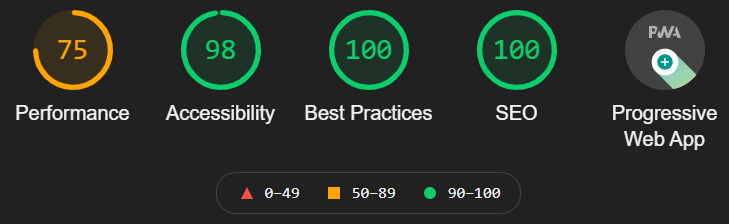

After initial testing, all metrics were above 90% with the exception of performance, which has a score of 75%. However after inspecting the main reasons for this, I chose not to enact any fixes for the following reasons;

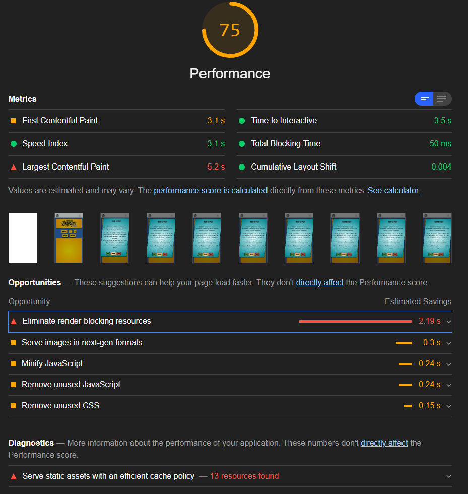

- **Eliminate render-blocking resources**: The resources slowing load speed are all bootstrap and core scripts, which are required for the website to function properly. Therefore can not be removed or deferred from load.
- **Serve Static Assets with an efficient cache policy**: Changing cache policy requires server side configuration, which is not possible while using GitPages for deployment hosting.

## Responsive Device & Browser Testing
To test the responsiveness of the site I used [Chrome DevTools](https://developers.google.com/web/tools/chrome-devtools), [Responsive Design Checker](https://www.responsivedesignchecker.com/) and [Lambdatest](https://www.lambdatest.com/).

### Responsiveness
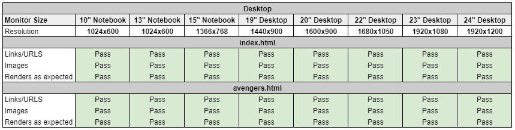

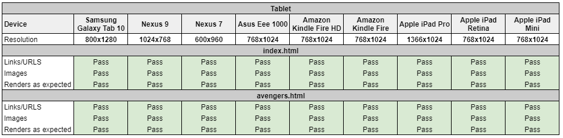

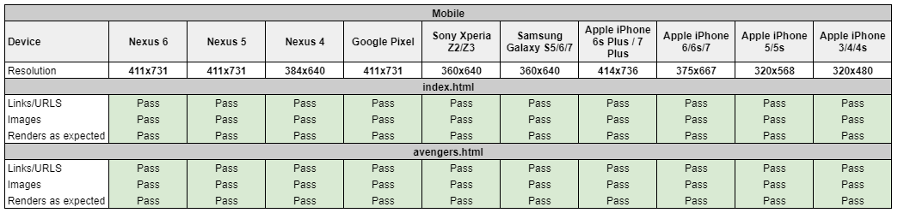

To ensure responsive I used bootstrap, flexbox methods and containers to ensure all site pages resized responsively for all device viewports. Additionally for small viewports, I created a media query which resizes the game memory cards to half their desktop size, this is so users do not need to scroll excessively while playing.

### Browser Compatibility
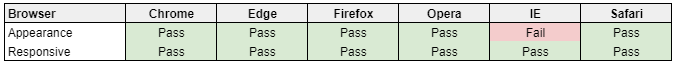

Through testing I found some bugs on the Safari and Firefox browsers, where the 'hidden' (avenger) side of the playing cards would not display properly once they are flipped. My fix for these issues is documented in the 'Issues I had to overcome' section.

Additionally the site does not load properly while using Internet Explorer, due to issues with bootstrap compatability.

According to [caniuse](https://caniuse.com/usage-table) the current usage of Internet Explorer is just 1.1% or total browser users, therefore I am comfortable to not support IE in the site design.

Note: Microsoft released Internet Explorer in 2013 and ceased active development in 2015, when Microsoft Edge was released as it's replacement, as evidenced by [this article](https://techcommunity.microsoft.com/t5/windows-it-pro-blog/the-perils-of-using-internet-explorer-as-your-default-browser/ba-p/331732) from Microsoft's design team. Since 2015 Microsoft has been actively encouraging users to adopt Edge over Explorer, with the only remaining updates for IE, being security patches and bug fixes.

## Testing User Stories
 - As a curious user, I want the home screen to be visually appealing, as this will positively aid my decision in whether I want to play the game. 
    - When the user is navigating the site, they'll see the game logo and website banner at the top of each page.
    - The site also has a favicon depicting the game logo, that makes the website recognisable while looking at browser tabs and bookmarks.
    - The game uses bright vibrant colours, which will entice possitive emotional response from users. According to this article by [99 Designs](https://99designs.co.uk/blog/tips/how-color-impacts-emotions-and-behaviors/) The use of strong yellow colours should promote users to feel happy and spontaneous, while blue should promote a feeling of safety and relaxation.

 - As a user, I want the site to be easy and intuitive to navigate.
    - On all pages of the website, the simple navigation bar is fixed to the top of the page, which allows easy navigation to all other pages of the website. When scrolling, the navigation bar remains at the top of the viewport, for easy access.

 - As a user, I want to easily access the game, tutorials, difficulty and audio controls for the website.
    - On the index page, there is a game controls ribbon, situated just above the game panel. The controls ribbon contains buttons, allowing the user easy access to difficulty settings, how to play explanation, game reset and audio controls.

 - As a user, I want to be able to choose a difficulty level for the game and know how the game changes across difficulty.
    - Upon page load and via choosing the 'Difficulty' button or 'How to Play' navbar link, a modal is called. Within this modal, the user can choose easy, medium or hard difficulty modes - each higher difficulty relaunches the game with increased number of cards.

 - As a user, I want to be able to restart the game if necessary, without having to navigate away from the game screen.
    - Situated just above the game panel is 'restart game' button, this resets the game panel based upon your current difficulty choice. All cards and regenerated, reshuffled, the move and timer counters are also reset.

 - As a user, I want to be able to keep track of the number of moves I make and the time I take to complete the game, so I can try to improve on future plays.
    - Situated just above the game panel, there are move and timer counters, which allow the user to quickly see how many moves they've taken in their current game and time elapsed. Additionally, when the game is completed, the players final move and time taken are displayed in a 'congratulations' modal.
 
 - As a user, I want the cards to be randomised, so the image locations are different with each replay. 
    - When a difficulty is chosen, or the current game restarted, JavaScript has been used to randomise the position of all generated cards, so no playthrough is ever the same.

## Issues I had to overcome

- **Modal loading on page load**: 

    I wanted the 'how to play' modal to load when the page is opened, as this this puts the start game mechanism (game difficulty buttons) in front of the user as soon as possible. To achieve this utilised a script found on the following [stack overflow post](https://stackoverflow.com/questions/10233550/launch-bootstrap-modal-on-page-load).

- **Setting difficulty and starting game on difficulty button click**: 

    When users choose their game difficulty, I wanted the how-to-play modal to close instantly and the game to populate the cards in line with difficulty choice via *diffChoice()* and *startGame()* functions

    Originally I attempted to add an event listener to the difficulty buttons via use of JavaScript, which would call the functions upon click. Fowever the event listener would not work as I intended. I overcame this difficulty by adding *'onclick="diffChoice(); startGame()'* to the buttons within the HTML itself. By adding this, when the buttons are clicked by a user, both the *diffChoice()* and *startGame()* functions are called correctly.

- **Safari - Marvel Character images disappearing on page flip**: 
    
    Upon testing of browser compatability, I came across an issue with Safari and mobile browsers, this was due to my use of 'radial-gradient' CSS as on the cards.

    In my original game design, through the use of css styles background, background-image: radial-gradient and backface-visibility:hidden, I was able to create the below visual styling for the cards. This was done via using setting the *"background-image:radial-gradient(circle, lightblue, darkblue)"* to the 'memory-card' div, while setting the 'A' logo and Marvel Character images as 'background' in it's child divs of 'front-face' and 'back-face'.

    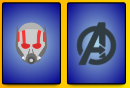

    Visually i was very pleased with this, as the halo effect around character images gives a strong comic book styling.

    However while testing in Safari, a bug became apparent where when the card is flipped, the character image would disappear. This is because browsers view 'radial-gradient' as an image and safari re-orders the image layers when dealing with backface-visibility transformations, essentially placing the character image would be placed under the memory card background and hiding it from users view.

    To rectify this, I updated the background used on the front-face card side to be a standard *'background-colour'*, which does not trigger safari to reorder the visual layers.

- **Firefox - backface visibility not showing on card flip**: 

    During browser testing, I also noticed a bug in firefox, where the backface of the card was not displaying once flipped, as seen below;

    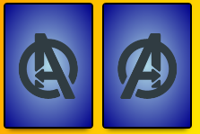

    After researching this online, I found [this post on Stack Overflow](https://stackoverflow.com/questions/9604982/backface-visibility-not-working-properly-in-firefox-works-in-safari), which explained this was a bug with firefox's use of the *'backface-visibility: hidden'* css style and the solution is to add *'transform: rotateX(0deg)'* to both front and back face divs.

    After adding the *'transform: rotateX(0deg)'*, the marvel character image and background now display correctly.

- **Volume slider move with Mute/Unmute**: 

    After adding the volume slider and volume mute functionality to the website, I wanted them to interact together so as to improve user experience. When 'Sound' setting is toggled to 'off', the volume slider should set to zero. Also when sound is toggled on, I wanted the volume slider to return to it's previous value.

    Top accomplish this I found the following [post on stackoverflow](https://stackoverflow.com/questions/60341429/how-to-reset-input-type-range-to-0-on-volume-slider-when-clicking-on-the-mute-bu), which I adapted code from.

- **Adding difficulty buttons to Congratulations modal and launching game":

    So ass to ensure a smooth user experience, I wanted to add options to relaunch the game using difficulty choices on the congratulations modal. This is to avoid the user having to manually close the modal, to manually open the 'difficulty' modal.

    However when adding the difficulty buttons to the congratulations modal, the game would not launch. This was because the button ID's of 'easy', 'medium' and 'hard' were no longer unique and this ID's are integral the functions which populate game cards. Specifically the *diffChoice()* function which determines number of gamecards to generate and the *createCardLayout()* function, which generates card class names.

    To rectify this, I altered the new difficulty button ID's in the congratulations modal to 'easy2', 'medium2' and 'hard2'. I then expanded the *diffChoice()* function, to include recognition of these ID's as inputs.

    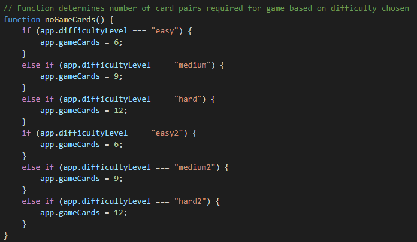

    As the difficulty ID is also used in the card class name generation, I also added the 'difficulty2' variant ID's to the card classes in *style.css*.

    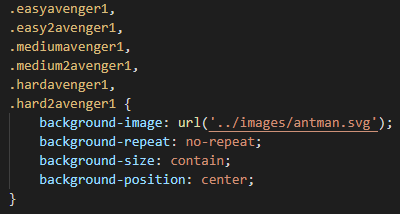

- **Make Cards uninteractive once matched**:

    Within the design of the game, it is important that once matched, cards become uninteractive. This is to avoid matched cards being accidently unflipped and also preventing them for being accidently fed into further matching logic.

    To achieve this, I originally attempted to remove event listeners from cards once matched, however upon initial testing, the event listeners would not deactivate as I wished. To rectify this I changed my approach and updated the *'disableCards()'* function to instead add css style *'pointer-events: none'* - thereby making them uninteractive to click events.

    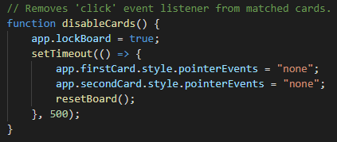

## Issues still to overcome

- **Toggle Sound Mute On/Off when volume slider set to/from Zero**:

    When the volume slider is set to 'zero', the 'Sound' toggle should set to 'Off' and when the volume slider is moved above zero, the 'Sound' toggle should set to 'On'. This is currently not set, due to scripting difficulties.

